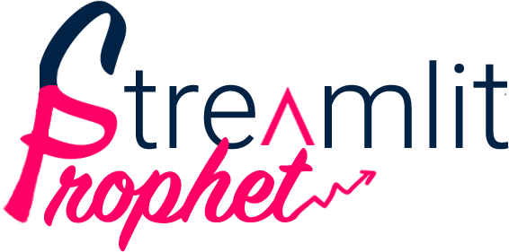

<div align="center">



[](https://github.com/artefactory-global/streamlit_prophet/actions/workflows/ci.yml?query=branch%3Amain)
[](#supported-python-versions)
[](https://github.com/artefactory-global/streamlit_prophet/pulls?utf8=%E2%9C%93&q=is%3Apr%20author%3Aapp%2Fdependabot)
[](https://prophet.streamlit.app)

[](https://github.com/psf/black)
[](https://github.com/PyCQA/bandit)
[](https://github.com/artefactory-global/streamlit_prophet/blob/main/.pre-commit-config.yaml)
[](https://github.com/artefactory-global/streamlit_prophet/releases)
[](https://github.com/artefactory-global/streamlit_prophet/blob/main/LICENSE)

Deploy a [Streamlit](https://streamlit.io/) app to train, evaluate and optimize a [Prophet](https://facebook.github.io/prophet/) forecasting model visually

## ⭐  Quick Start  ⭐

[Test the app online](https://prophet.streamlit.app) with shared computing resources & [read introductory article](https://medium.com/artefact-engineering-and-data-science/visual-time-series-forecasting-with-streamlit-prophet-71d86a769928?source=friends_link&sk=590cca0d24f53f73a9fdb0490a9a47a7)

If you plan to use the app regularly, you should install the package and run it locally:
```bash
pip install -U streamlit_prophet
streamlit_prophet deploy dashboard
```

</div>

https://user-images.githubusercontent.com/56996548/126762714-f2d3f3a1-7098-4a86-8c60-0a69d0f913a7.mp4

## 💻 Requirements

### Python version
* Main supported version : <strong>3.7</strong> <br>
* Other supported versions : <strong>3.8</strong> & <strong>3.9</strong>

Please make sure you have one of these versions installed to be able to run the app on your machine.

### Operating System
Windows users have to install [WSL2](https://docs.microsoft.com/en-us/windows/wsl/) to download the package. 
This is due to an incompatibility between Windows and Prophet's main dependency (pystan). 
Other operating systems should work fine.

## ⚙️ Installation


### Create a virtual environment (optional)
We strongly advise to create and activate a new virtual environment, to avoid any dependency issue.

For example with conda:
```bash
pip install conda; conda create -n streamlit_prophet python=3.7; conda activate streamlit_prophet
```

Or with virtualenv:
```bash
pip install virtualenv; python3.7 -m virtualenv streamlit_prophet --python=python3.7; source streamlit_prophet/bin/activate
```


### Install package
Install the package from PyPi (it should take a few minutes):
```bash
pip install -U streamlit_prophet
```

Or from the main branch of this repository:
```bash
pip install git+https://github.com/artefactory-global/streamlit_prophet.git@main
```


## 📈 Usage

Once installed, run the following command from CLI to open the app in your default web browser:

```bash
streamlit_prophet deploy dashboard
```

Now you can train, evaluate and optimize forecasting models in a few clicks.
All you have to do is to upload a time series dataset. 
This dataset should be a csv file that contains a date column, a target column and optionally some features, like on the example below:


Then, follow the guidelines in the sidebar to:

* <strong>Prepare data</strong>: Filter, aggregate, resample and/or clean your dataset.
* <strong>Choose model parameters</strong>: Default parameters are available but you can tune them.
Look at the tooltips to understand how each parameter is impacting forecasts.
* <strong>Select evaluation method</strong>: Define the evaluation process, the metrics and the granularity to
assess your model performance.
* <strong>Make a forecast</strong>: Make a forecast on future dates that are not included in your dataset,
with the model previously trained.

Once you are satisfied, click on "save experiment" to download all plots and data locally.


## 🛠️ How to contribute ?

All contributions, ideas and bug reports are welcome! 
We encourage you to open an [issue](https://github.com/artefactory-global/streamlit_prophet/issues) for any change you would like to make on this project.


For more information, see [`CONTRIBUTING`](https://github.com/artefactory-global/streamlit_prophet/blob/main/CONTRIBUTING.md) instructions.
If you wish to containerize the app, see [`DOCKER`](https://github.com/artefactory-global/streamlit_prophet/blob/main/DOCKER.md) instructions.
