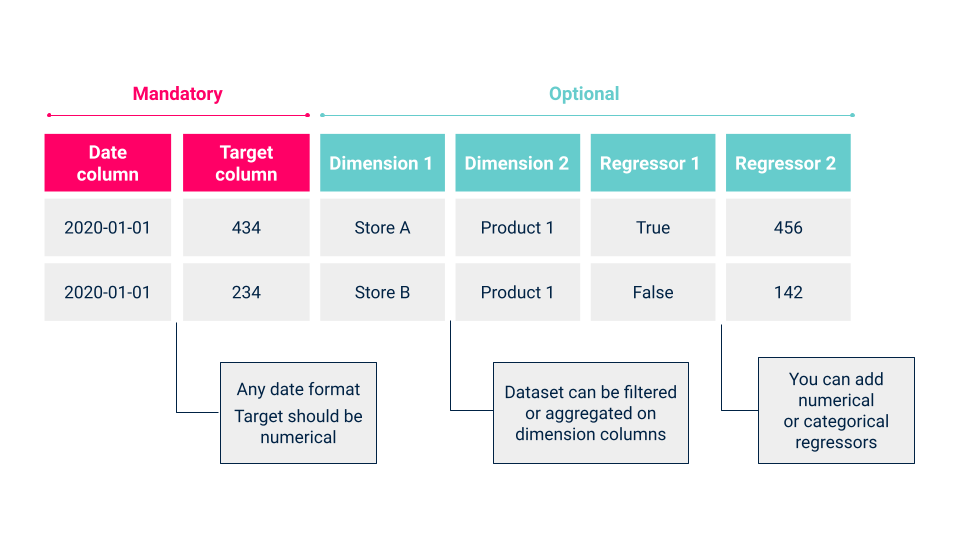

<div align="center">
<h1>Streamlit Prophet</h1>

[](https://github.com/artefactory/streamlit_prophet/actions/workflows/ci.yml?query=branch%3Amain)
[](#supported-python-versions)
[](https://github.com/artefactory/streamlit_prophet}/pulls?utf8=%E2%9C%93&q=is%3Apr%20author%3Aapp%2Fdependabot)

[](https://github.com/psf/black)
[](https://github.com/PyCQA/bandit)
[](https://github.com/artefactory/streamlit_prophet}/blob/main/.pre-commit-config.yaml)
[](https://github.com/artefactory/streamlit_prophet/releases)
[](https://github.com/artefactory/streamlit_prophet}/blob/main/LICENSE)

`streamlit_prophet` is a Python package that deploys a Streamlit app on which you can 
train, evaluate and optimize a [Prophet](https://facebook.github.io/prophet/) forecasting model

</div>

The deployed app is available [here](https://streamlit-prophet-dot-data-sandbox-fr.ew.r.appspot.com/).

## 💻 Supported Python Versions

<p>Main version supported : <strong>3.7</strong> <br>
Other supported versions : [TBD] </p>

Please make sure you have one of these versions installed to be able to access the app locally.


## ⚙️ Installation


### Create a virtual environment (optional)
If you want to avoid any dependencies issues, first create and activate a new virtual environment.

For example with conda:
```bash
pip install conda; conda create -n streamlit_prophet python=3.7; conda activate streamlit_prophet
```

Or with virtualenv:
```bash
pip install virtualenv; python3.7 -m virtualenv streamlit_prophet --python=python3.7; source streamlit_prophet/bin/activate
```


### Install package
Install the package from the main branch of this repository:

```bash
pip install git+ssh://git@github.com/artefactory/streamlit_prophet.git@main
```


## 📈 Usage

Once installed, run the following command from CLI to access the app:

```bash
streamlit_prophet deploy dashboard
```

Now you can train, evaluate and optimize a forecasting model in just a few clicks.
All you have to do is to upload a time series dataset, that contains a date column, a target column and optionally some features, like on the example below:



Then, follow the guidelines in the sidebar to:

* <strong>Prepare data</strong>: Filter, aggregate, resample and/or clean your dataset.
* <strong>Choose model parameters</strong>: Default parameters are available but you can tune them.
Look at the tooltips to understand how each parameter is impacting forecasts.
* <strong>Select evaluation method</strong>: Define the evaluation process, the metrics and the granularity to
assess your model performance.
* <strong>Make a forecast</strong>: You can optionnaly make a forecast on future dates that are not included in your dataset,
with the model previously trained.


## 🛠️ How to contribute ?

If you want to contribute to the development of this package:

1. Clone the repository:

```bash
git clone git@github.com:artefactory/streamlit_prophet.git
```

2. If you don't have `Poetry` installed, run:

```bash
make download-poetry; export PATH="$HOME/.poetry/bin:$PATH"
```

3. Initialize poetry and install `pre-commit` hooks:

```bash
make install
```

And you are ready to develop ! For more information, see [`CONTRIBUTING`](https://github.com/artefactory/streamlit_prophet/blob/main/CONTRIBUTING.md) instructions.
If you wish to containerize the app, see [`DOCKER`](https://github.com/artefactory/streamlit_prophet/blob/main/DOCKER.md) instructions.


## ✏️ Citation

```
@misc{streamlit_prophet,
  author = {artefactory},
  title = {`streamlit_prophet` is a Python package that deploys a Streamlit app on which you can train, evaluate and optimize a Prophet model},
  year = {2021},
  publisher = {GitHub},
  journal = {GitHub repository},
  howpublished = {\url{https://github.com/artefactory/streamlit_prophet}}}
}
```

## ©️ Credits

This project was generated with [`ppt`](https://github.com/artefactory/ppt).
